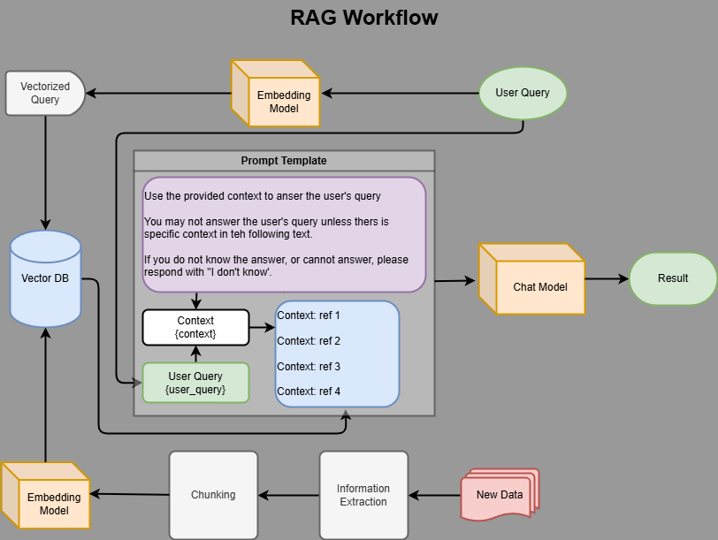

# agent_of_bias
# **UNDER CONTRUCTION** This is an experimental AI agent to identify the bias in news and opinion articles.
## *combining with a RAG AI that was also under development

# Local RAG (Retrieval Augmented Generation)

### What is RAG?
RAG = Information Retrieval + In-Context Learning

### Basic RAG Workflow

### Tools

- Python - Programming Language for this tool
- - Draw.io Integration (extension for flowchart development)
- Ollama - Open-source platform to that runs LLMs (Large Language Models) locally
- Langchain - framework of tools to connect LLMs to other data sources
- Langsmith - Monitoring tool
- Streamlit - Used to build the UI
- ChromaDB - Creates the vector database to store new information

> pip install -r requirements.txt

The primary goal of this demo is to build a local data pipeline to analyze new data using RAG.

The secondary goal is to structure the pipeline to simplify testing different models and prompts.

### Ollama models used here

- llama3.2:3b (primary llm)
- mxbai-embed-large (embeddings model)
- nomic-embed-text:v1.5 (alternate embedder)

- RAG Evaluation Framework / Metrics / Techniques
- - qllama/bge-reranker-v2-m3:latest (prompt reranker)

### References

- https://www.youtube.com/watch?v=c5jHhMXmXyo - local RAG Chatbot
- https://www.youtube.com/watch?v=gcqp3Fbv4_o - RAG Pipeline
- https://www.e2enetworks.com/blog/guide-to-building-a-rag-based-llm-application RAG Guide from 2023
- https://medium.com/@krtarunsingh/an-in-depth-exploration-of-rag-retrieval-augmented-generation-611a0ddaba81 June 2024
- https://www.youtube.com/watch?v=uFhDXUOrgO0
- https://www.youtube.com/watch?v=vf9emNxXWdA & https://www.youtube.com/watch?v=g8OViy0xOoI RAG Walkthrough for 2025
- https://www.youtube.com/watch?v=sVcwVQRHIc8 LangChain walkthrough
- https://www.youtube.com/watch?v=wVdiT78-wS8 Video on chunking data

#### Test data source
https://www.congress.gov/browse

## Future Project

### Context Engineering

- [Context Engineering Tutorial](https://www.youtube.com/watch?v=Egeuql3Lrzg)

Features to design:
1. Build a local AI model.
2. Develop a data input route for the sample texts. Start with a simple copy/paste (thru a gui?
)
3. Parse the text for analysis.
4. Analyze for bias based on predetermined keywords.

Future Improvements:
1. Incorporate an article retreival agent, enter the article URL and it's retrieved automatically.
2. Save the analyzed articles for reference.
3. Experiment with different analysis methods.
4. Add options to the GUI for testing different models and comparing results.

I have discovered a model that has been fine tuned to find bias, wonder if this can be fine-tuned further for political bias...
https://huggingface.co/EmergentMethods/Qwen3-4B-BiasExpert

### The text below was generated by Google Search Labs | AI Overview
---
Building a word sentiment analysis AI: a step-by-step guide
Sentiment analysis, also known as opinion mining, is a branch of natural language processing (NLP) that aims to determine the emotional tone conveyed in text. By automating this process, businesses can analyze large quantities of customer feedback, social media mentions, and other text data to gauge public opinion and make data-driven decisions. 
Here's a step-by-step guide to building a word sentiment analysis AI:
1. Defining the objective and gathering data
Determine the Goal: Clearly define the purpose of your sentiment analysis. Are you trying to understand customer sentiment towards a product or service? Analyze brand perception on social media? Gauge the effectiveness of a marketing campaign?
Identify Data Sources: Gather relevant text data from sources such as social media platforms, online review sites, surveys, emails, articles, or other sources where opinions are expressed.
Collect and Label Data: Obtain a substantial dataset of texts and label each instance with its corresponding sentiment (e.g., positive, negative, neutral). Manual labeling offers the highest accuracy but can be time-consuming and expensive. Automated tools or existing datasets can also be leveraged. 
2. Preprocessing and feature engineering
Clean and Standardize Data: Raw text data often contains noise that needs to be removed for accurate analysis. Common techniques include:
Lowercasing: Convert all text to lowercase for consistency.
Tokenization: Break down text into individual words or phrases (tokens).
Stop Word Removal: Eliminate common words (like "the" or "and") that don't contribute significantly to sentiment.
Lemmatization or Stemming: Reduce words to their base form (e.g., "running", "runs", "ran" become "run").
Remove Special Characters and Punctuation: Remove characters that might interfere with analysis.
Feature Engineering: Extract features from the processed text that can help the model identify sentiments. Techniques include:
Part-of-Speech (POS) Tagging: Identify the grammatical function of each word (e.g., noun, verb, adjective). Some parts of speech carry more sentiment weight.
N-grams: Analyze sequences of words that hold stronger sentiment value than individual words. 
3. Selecting and training a model
Choose a Sentiment Analysis Approach: Decide on the approach best suited to your needs:
Rule-based Systems: Rely on pre-defined dictionaries (lexicons) of words and phrases with assigned sentiment values. Simple to implement but may struggle with nuances of language.
Machine Learning (ML) Models: Algorithms like Naive Bayes, Support Vector Machines, or deep learning models are trained on large datasets to learn patterns in language and classify sentiment.
Hybrid Approaches: Combine rule-based and machine learning techniques for a balance of speed and accuracy.
Model Selection: Choose an appropriate machine learning model for sentiment analysis. Some common algorithms include:
Naive Bayes (NB): Probabilistic classifier based on Bayes' theorem, according to AIMultiple.
Support Vector Machines (SVM): A fast and efficient classification algorithm, notes IBM.
Deep Learning Models (e.g., RNNs, LSTMs): Can learn complex patterns and nuances in language but require large datasets for training.
Split the Dataset: Divide the data into training, validation, and test sets to prevent overfitting and assess the model's performance on unseen data.
Train the Model: Use the labeled training data to teach the chosen algorithm to recognize relevant patterns and predict sentiment. 
4. Evaluating and refining the model
Model Evaluation: Assess the model's performance using metrics like accuracy, precision, recall, or F1-score.
Fine-Tune the Model: Optimize hyperparameters and experiment with different features, algorithms, or architectures to improve performance.
Analyze Errors and Limitations: Identify areas for improvement by analyzing the model's errors and limitations. 
5. Deployment and application
Deployment: Implement the trained model into your application or workflow, potentially using pre-built sentiment analysis models or systems that can be customized for specific needs.
Real-time Analysis: Utilize the model to analyze sentiment in real-time or near real-time.
Data Visualization: Present the sentiment analysis results clearly using techniques like bar charts, word clouds, or sentiment timelines.
Continuous Monitoring and Improvement: Regularly monitor the model's performance, update it with new data and adapt to evolving trends, slang, and expressions. 
Challenges in sentiment analysis
Despite advances in NLP, sentiment analysis faces challenges like: 
Sarcasm and Irony: These expressions are difficult for AI to interpret accurately as they rely heavily on context and tone.
Negation: Words like "not" or "never" can reverse the meaning of a sentence, leading to incorrect classifications.
Multipolarity: Sentences can contain both positive and negative sentiments, making it challenging to determine the overall tone.
Context-dependent errors: The meaning and sentiment of words can change based on the surrounding text.
Multilingual Data: Sentiment analysis across different languages poses challenges due to diverse linguistic contexts and cultural differences. 
Overcoming challenges
Sophisticated Algorithms: Develop and use advanced algorithms and deep learning models to handle complexities like sarcasm and contextual nuances.
High-Quality Training Data: Ensure the training datasets are diverse and accurately labeled to improve model performance.
Domain Knowledge and Context: Incorporate domain-specific knowledge and ensure the model understands the context in which words are used.
Multilingual Support: Train models on multilingual data and use techniques that can handle different languages and dialects.
Ethical Considerations: Be aware of the potential for bias in training data and ensure fair and responsible use of the sentiment analysis AI.  
By carefully addressing these steps and challenges, you can build a robust and effective sentiment analysis AI to derive valuable insights from textual data.
What is Sentiment Analysis? - AWS
What is Sentiment Analysis? Sentiment analysis is the process of analyzing digital text to determine if the emotional tone of the message is positive, negative,
favicon
Amazon Web Services
What Is Sentiment Analysis? Essential Guide - Datamation
Apr 23, 2024 — What Is Sentiment Analysis? Essential Guide. ... Datamation content and product recommendations are editorially independent. We may make money when you click on...
favicon
www.datamation.com

How to Train a Machine Learning Model for Sentiment Analysis
Oct 26, 2023 — What are the key steps to train a machine learning model for sentiment analysis? * 1. Data collection. * 2. Data preprocessing. * 3. Model selection. * 4. Model...
favicon
LinkedIn

